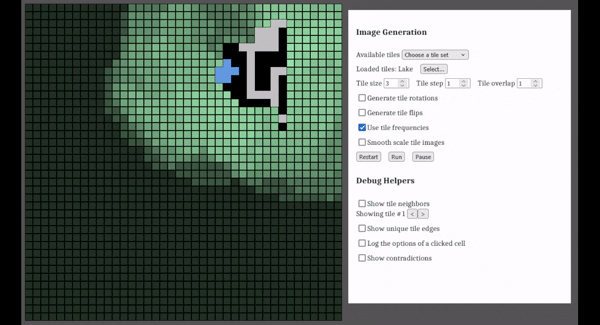

# Hybrid Wave Function Collapse

The hybrid wave function collapse algorithm in actions:

## Why

I partially watched Daniel Shiffman's video on his effort to implement the WFC
(wave function collapse) algorithm. I was interested enough to clone the code
repo and try it out.

I immediately hit two roadblocks.

One is that my personal computer is very old. That meant than running the
overlapped-model WFC algorithm, for the flowers tile-set, was excruciatingly slow.
On the other hand, the tiled-model WFC ran at an acceptable speed but had hard-coded
edge matching, which meant that it was not simple to switch between different tile
image sources.

So, I decided to start by fixing the tile-model WFC by adding auto-detecting of
matching tile edges. And down the rabbit hole I went...

## Final Result

Before going deep in all the detailed description of what I ended-up doing,
let me outline the final result I've reached so far. My hybrid-model WFC
provides the following features:

### Super multiple model types

Support both tile-based and overlapping models.

The tile-based models contain multiple images. That is, there is one pre-made
image for each tile. In that case I added code to auto-detect which tile can
be placed next to which other tiles. This is done by matching tile edges.

The overlapping models contains a single image. The image is automatically
divided into overlapping tiles, which provides directly which tile can be
placed to which other tiles. But, those implicit neighbors are augmented
by once again matching tile edges.

### Speed Optimization

The code running speed was greatly improved by:

- Using bit-maps to track tile and grid-cell options, which allows super fast
  unions and intersections.
- Avoiding recreating objects as much as possible by reusing existing objects
  when possible.
- Using change propagation to limit how many cell are updated.
- Only redrawing changed cell. (This was a very minor speed improvement.)

### User interface

Added a UI (user-interface) to allow:

- Selecting among the pre-made tile-model and overlapped-model image sources
- Loading any image as source
- Restarting and pausing the WFC algorithm
- Setting the overlapped model tile size and overlap
- Turning tile rotations and flips on and off
- Turning drawing smoothing on and off
- Exploring the resulting tiles and their possible neighbors
- Exploring the resulting tile edges
- Exploring the neighbor options of a tile that is clicked on

## Detailed Changes

### Matching Edges

The first thing I wanted was to be able to try different tile sets. The code was
originally written with hard-coded tile edges description with a different text
associated with each different edge. So an edge of type 1 would be "AAA", one of
type 2 would be "BBB" and so on.

This meant that I would have to analyze visually each tile set and write by hand
the description of each tile edges. Super cumbersome. So I decided that writing
code to extract each tile's edges and matching edges together by image comparison
was the first thing I needed to add.

This took me surprising long to ge perfectly right. Mostly because:

- P5js annoyingly keep image pixels as a linear array (instead of a 2D array)
  and each pixel is not kept as a unit, but each RGBA value is kept separately.
  Both of these make it more error-prone and verbose to read and write pixels.
- I had not written any debugging aid, so figuring what was wrong with new code
  was more burdensome that it needed to be.
- The pre-made tile-sets sometimes had tile that were just slightly not matching
  each other, with pixels being off-by-one between tile edges.
- Some pre-made tile-sets have a random background that do not match between tiles.
  For example, the Pipes set has such a background.
- Javascript creates on-the-fly new variables when one accesses a non-existing
  value on an object. This makes it hard to find typos.
- Let's face it: I'm not a JS (Javascript) programmer by trade. I had written
  a few small things in the past, but I had forgotten most of JS syntax and had
  to relearn most of everything, which led to more errors and slower initial
  progress.

Some of the things that got me out of the wood:

- Writing debugging aids to draw tiles and their matching neighbors and draw
  the edges I had extracted.
- A lot of console.log...

### History Rewinding

AS soon as I had tile-sets working, I found annoying that the algorithm would
restart from scratch when a contradiction was reached. I decided that being
able to rewind the last few steps of the algorithm was needed.

The WFC algorithm keeps an grid array of cells containing both the collapsed
cells with their final tile and all options for all cells that have not yet been
collapsed. I immediately went for an easy and effective solution: just keep an
array of past grids. This means copying the grid at each step, but that is
cheap because it is a shallow copy, just copying a few hundreds values, which
is super fast since copying an existing array is a built-in function of Javascript.

When a contradiction is reached, the algorithm pops off the last few grids and
continue from the last remaining past grid. Each time a contradiction is reached,
the amount of past grids that are popped off is increased, so we can keep going
back further and further. When We get past the point where the contradiction was
found, the amount of rewinding is decreased.

This simple approach has worked well and is not a performance bottleneck at all.

### Locating Performance Problems

Performance was the next blocker. I could not use the single-image overlapped
model because it was too slow on my 15-years old computer. Clearly, the algorithm
needed improvement.

Jeff has a long experience of using P5js and knows from experience that bad
drawing code can make algorithms slow. Experience is good! On the other hand,
while past experience is indeed invaluable, the issue here is that the best way
to identify performance problems is almost never to just guess. The best way to
identify problems is with measurements. That is not limited to performance
problems, but to any kinds of problems. For performance problems, there are tools
specifically designed to gather measurements. These tools are called performance
profilers, usually just called "profiler". All modern web browsers come with a
profiler built-in.

So, that's what I used. In Firefox, the profiler is in the developer tools,
which can be opened with the F12 keyboard shortcut. They can also be reach via
the menu "More Tools" > "Web Developer Tools". In the tool panel, there is a
"Performance" tab. Using the profiler is easy. You start the profiler by clicking
the "Start recording" button while the algorithm runs slowly. Then, after a few
seconds have elapsed, click the "Capture recording" button to stop the profiler.
This opens the performance measurement results in a brand new browser tab.

The profiling tool is of course quite technical, but the important information
is automatically expanded at the bottom: the functions that consume the most
time. The first column is the cumulative percentage, so identifying the problems
involves finding where there is a big change in percentages. For example if the
a function takes 74% of the time, but all the children functions collectively
only take 10%, it means the function is taking 64% of the time (74 - 10).

There are two important points about this performance measurement to be aware of.

First, the reporting is given by functions. This means that if your functions are
very long, if they contain a lot of code, then the results are only crudely divided.
To get more details on where performance drops, having smaller functions gives
more accurate locations.

Second, all the tool does is provide where most of the time is spent. It does
not tell you *why* that code is slow. Finding the whys is your job. How I did
it in this case is covered in the next section.

### Fixing Performance Problems

Once I had the names of the functions where the code was running slow, it was
time to analyze what is going on. That requires looking and the code, what it
does, how the data is organized. Figuring out why that code or data could lead
to slow performance requires both knowledge and experience.

The reason you need knowledge and experience is because you need both to be able
to recognize common culprits and know good algorithms and data structure and when
they should be used or not.

I do not know the status of programming AI right now, but I suspect they will
be able to help on that front in the future. They might even be able to help
right now, but I haven't try to ask them to analyze code and tell me how to make
it faster. Maybe they can already identify bad performance and suggest fix!

In this particular case, I was able to identify that the code was trying to do
unions and intersections using arrays. There are better alternatives to do these
operation faster. I initially replaced all cell and tile options with Javascript
Sets. That made the code a lot faster. It was still not brisk but fast enough.
I later replaced sets with bit-maps. Bit-maps are good when you need to operate
on sets of integers. Basically, they map each integer to a single bit in an array
of bits. If a bits at offset N is on, it means the integer N is included. This
means unions and intersection are done by simply doing OR and AND on bits, which
is just about the fastest thing a computer can do. That made the code much faster.

### Adding Debugging Aids

Now that the algorithms were fast enough, I could use the WFC and play with it.
That's when I discovered there were multiple case where things were not working
properly. Some of the problems were pre-existing, but most of problems were due
to the changes I had done. After all, the code I had started initially only
supported tiled-model, so I had changed the code extensively and introduced cases
that did not exist before.

That is when I added code to show tile possible neighbors, tile edges and cell
options, visually. Once again, one cannot diagnose problems without data. Being
able to see what the algorithm produced allowed me to identify the case that were
wrong and try to find where the code was mis-behaving.

In myh experience, and Jeff's multiple videos amply provide additional proofs,
writing visualization helpers to be able to see the data is key to understand
where things go wrong. If you cannot see your data, it becomes much harder to
figure out what is going on.

### Adding UI

Once things were mostly working right, I wanted to be able to test various
tile sets quickly and control how they were used. That's when I added a user
interface to choose tile-sets and parameters controlling the WFC algorithm.
This avoided the tedium of changing code to change tile-set.

That is when I added the tile loaders. The tile loader made it easy to package
each tile set and run the appropriate code to load the images and process them
to prepare them for the WFC algorithm.

### Adding Change Propagation

At that point, things were running smoothly, but the performance profiler was
still showing that as lot of time was spent in updating the cells. I had added
a limit to the propagation of cell collapse, but that led to more contradictions.
The algorithm was rewinding a bit too often to my taste. I read that Jeff planned
to replacing the whole-sale recalculation of all cell with change propagation.

I was not sure if it would lead to better performance or not. It was not clear
to me if collapsing a cell would require most other cells to update or only a
few. I mostly convinced myself that the change would stop propagating a few
cells away since those far-away cell would be surrounded by empty cell with
few constraints. But, as always, only true experimentation with hard data could
possibly answer, so I implemented change propagation.

I did this by keeping an "updated" flag in each cell, which tells if the cell
options changed after the last cell collapse. The way I detect that a cell is
updated is by monitoring the result of intersecting the cell current options
with the new constraints of its neighbors. In practical term, I made it so that
the in-place-intersection function of the bit-map record if the intersection
affected any bit of the bit-map. If no bits changed, then the new constraints
did not affect the cell, so it does not need to be updated.

The result were immediate and clear. The very first update after the very first
cell collapse propagated most cells, but afterward most cell collapse would only
affect 10-100 cells. This is a great improvement: for a grid of 1600 cell, that
is a factor of between 16 to 160. That more than compensated the additional
amount of code run for each update.

### Optimizing Drawing

Once the change propagation was in place, for the first time the drawing code
was showing up as a significant percentage of run-time. When I initially started
to profile the code for performance, drawing was taking less than 1% of the time.
After using bit-maps, it was still less than 10%. But after change propagation,
it had climb ed to more than 35%. Now it was time to look into it.

By chance, change propagation was providing exactly the information needed to
improve drawing. Since I already had a cell flag telling me when a cell was
updated, all I needed to do was to only draw a cell when it was updated. The
drawing code went back to be around 13% versus the algorithm's 72%. Given that
now both were not even taking 100% of the time, that means even my 15 years old
computer was idle 25% of the time. No need to spent time on performance.

I took the time to also incorporate an idea from Jeff's overlapped tile WFC:
I now drew non-collapsed cells with the combined average color of all tile
options for each cell. With a enough transparency added, it gives a nice overview
of which cells are affected when a collapse it done. Neat!
